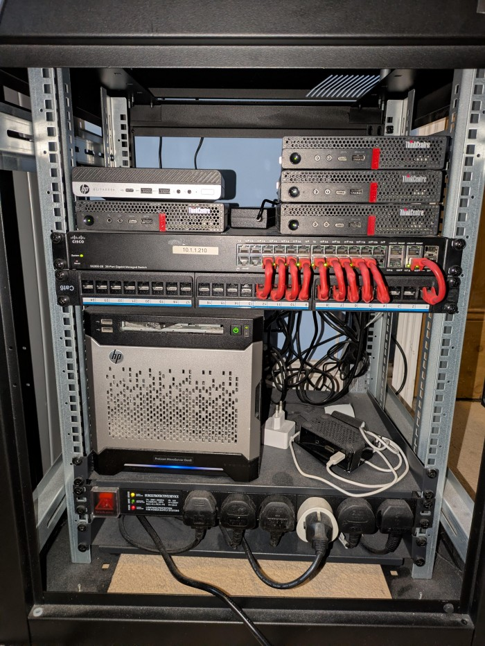

# Homelab
This repository manages the full lifecycle of my homelab infrastructure — provisioning LXC containers on Proxmox with Terraform, configuring them with Ansible, and orchestrating/deploying everything with Gitea/Github Actions CI/CD. Everything runs inside a self-hosted runner container (gitea-runner-tools from the runners repo).

- [Physical Infrastructure](#physical-infrastructure)
- [Prerequisites](#prerequisites)
  - [CI/CD Runner Image](#cicd-runner-image)
  - [Repo Secrets](#secrets)
  - [Repo Variables](#variables)
- [Repository Structure](#repository-structure)
- [Actions and Workflows](#actions-and-workflows)
  - [Composite Actions](#composite-actions)
  - [Reusable Workflows](#reusable-workflows)
- [Usage](#usage)
  - [Deploying a Service LXC](#deploying-a-service-lxc)
  - [Multi-Node Services](#multi-node-services)
  - [Building a Custom Base Template](#building-a-custom-base-template)
  - [Running Arbitrary Playbooks](#running-arbitrary-playbooks)
  - [Shared Ansible Playbooks](#shared-ansible-playbooks)
  - [Destroying a Service LXC](#destroying-a-service-lxc)
  - [Backups and Restores](#backups-and-restores)
- [Development Workflow](#development-workflow)
- [Reverse Proxy](#reverse-proxy)
  - [Adding a Route](#adding-a-route)

## Physical infrastructure
The current configuration is:
- A production 3-node Proxmox cluster with 2 Lenovo m720q's and an HP EliteDesk 800 G4, all with 8th gen i5's.
  - The Lenovos each have a dual 10GbE NIC installed to handle inter-cluster traffic. This is point-to-point routed to remove the need for a 10GbE switch.
  - The Lenovos are designed to absorb each other's load if a node goes down. ZFS replication runs every 15 minutes to allow quick failover with minimal data loss.
  - The HP has a desktop i5 rather than the low-power "T" versions in the Lenovos, so it handles workloads that benefit from higher single-core performance like databases.
  - All 3 nodes have 64GB RAM, 6 cores, 256GB 2.5" SSD boot drives, and 1TB NVMe's for VM/LXC storage. This allows seamless switching between nodes.
- A TrueNAS Core box on an HP Microserver Gen8 with 4 10TB SAS drives in RAIDZ1 for ~30TB usable.
  - The SAS drives connect to an HBA in the PCIe slot with 1 external port for future DAS or tape drive expansion.
  - 2 480GB SSDs are connected to the onboard SATA controller as mirrored vdevs for metadata, crammed where the optical drive used to be.
  - 16GB ECC RAM and a 256GB SSD boot drive.
- A single Lenovo m720q as a DEV Proxmox node for testing — i5, 6 cores, 16GB RAM, 256GB SSD, 256GB NVMe.
- A Proxmox Backup Server on another Lenovo m720q with an i3, 128GB NVMe boot drive, and 1TB power-loss-protected SSD.



## Prerequisites
### CI/CD runner image
Set `RUNNER_IMAGE` in repo variables to an accessible container image with Terraform, Ansible, Node.js, and [frender](https://github.com/aarasmith/frender) (a CLI Jinja2 renderer) installed.

Example:
```
git.arasmith.org/aarasmith/gitea-runner-tools:latest
```
[aarasmith/runners/gitea-runner-tools/Dockerfile](https://github.com/aarasmith/runners/blob/main/gitea-runner-tools/Dockerfile)

### Secrets
The following repo secrets are required:

| Secret | Description |
|---|---|
| `AWS_ACCESS_KEY_ID` | Access key ID for AWS provider |
| `AWS_SECRET_ACCESS_KEY` | Access key for AWS |
| `PVE_USER[_DEV]` | Proxmox username e.g. `some-username@pam` |
| `PVE_PASSWORD[_DEV]` | Proxmox password for the API provider |
| `LXC_PASSWORD` | Default root password for LXCs |
| `MASTER_SSH_PUBLIC_KEY` | Public key to inject into built infra |
| `MASTER_SSH_PRIVATE_KEY` | Private key to access built infra |
| `ANSIBLE_VAULT_PASSWORD` | Password for ansible-vault encrypted files |
| `RESTIC_PASSWORD` | Password for restic backups of persistent service appdata |

Ensure that the public key is also added to the PVE host as ansible needs to run a few commands on the host to dump template builder LXCs to a vzdump and rename the file.

 PVE_USER and PVE_PASSWORD are only required for the Proxmox Terraform provider as certain operations can't be done via API (like setting feature flags such as nesting and keyctl). This is only needed for 1 node, as API actions can be applied across the cluster from any node.

Individual services may use ansible vaults for service-specific secrets

Dev/feature branches use the same secrets suffixed with `_DEV` where applicable (e.g. `PVE_USER_DEV`, `PVE_PASSWORD_DEV`).

### Variables
The following repo variables are required:

| Variable | Description |
|---|---|
| `AWS_REGION` | AWS region for the backend bucket and any AWS infra |
| `AWS_TF_BACKEND_BUCKET` | Pre-existing S3 bucket name for Terraform state files |
| `GATEWAY` | Network gateway IP |
| `RUNNER_IMAGE` | Address of the actions runner image |
| `PVE_DEFAULT_NODE[_DEV]` | Name of the default Proxmox node (used for templates and lookups) |
| `PVE_DEFAULT_NODE_IP[_DEV]` | IP address of the default Proxmox node |
| `PVE_NODE_IP_<NODE-NAME>` | IP address of each Proxmox node e.g. `PVE_NODE_IP_MOTHER` |
| `PVE_DISK_STORAGE[_DEV]` | Name of the storage for LXC disks e.g. `local-lvm` |
| `PVE_API_URL[_DEV]` | Proxmox API endpoint e.g. `https://10.1.1.100:8006/api2/json` |
| `PVE_TEMPLATES_DIR[_DEV]` | Directory where templates are saved on the node e.g. `/mnt/pve/local/template/cache` |

Dev/feature branches use the same secrets suffixed with `_DEV` where applicable (e.g. `PVE_DEFAULT_NODE`, `PVE_DEFAULT_NODE_IP`, `PVE_DISK_STORAGE`, `PVE_API_URL`, `PVE_TEMPLATES_DIR`)

## Repository Structure

```
├── ansible/
│   ├── ansible.cfg
│   └── common/               # Shared ansible playbooks used across services
├── base-templates/           # Reusable LXC base images (docker, postgres17, etc.)
├── services/                 # Individual service configurations/data - essentially mini repos
├── terraform/
│   └── modules/
│       └── lxc/              # Reusable Terraform module for provisioning LXCs
└── .gitea/
    ├── actions/              # Reusable composite actions
    └── workflows/
        ├── base-templates/   # Workflows for building base template LXCs
        ├── common/           # Reusable callable workflows
        └── services/         # Per-service workflows
```

Each service under `services/` follows this structure:
```
services/<name>/
├── ansible/
│   ├── <service>-setup.yaml  # Idempotent setup playbook
│   ├── <playbook>.yaml       # Ansible playbooks for provisioning/updating/managing/migrating
│   └── vault.yaml            # Ansible-vault encrypted secrets (if needed)
├── docker-compose.yaml       # (optional) Docker Compose config
└── ...                       # Any other service-specific config files
```

## Actions and Workflows

### Composite Actions

Reusable composite actions live in `.gitea/actions/`. The key ones are:

- **`lookup-env`** — determines whether the current branch maps to `prod` (`main`, `release/**`) or `dev` (everything else). Used internally by all scoping actions.
- **`scope-pve-env`** — exposes PVE credentials and node config as step outputs for the current environment.
- **`scope-aws-env`** — exposes the correct S3 backend bucket as a step output.
- **`get-pve-node-ip`** — resolves a named Proxmox node (e.g. `mother`, `fish`, `fastfood`) to its IP for the current environment.
- **`lookup-lxc-vmid-node`** — queries the PVE cluster to find the VMID and node of a named LXC, exposed as step outputs.
- **`lookup-lxc-ip`** — resolves an LXC's IP from its VMID via `pct exec`.
- **`setup-ssh`** — writes the SSH private key to the runner container and scans the appropriate PVE nodes into `known_hosts`.

All actions expose values as step outputs rather than writing to `GITHUB_ENV`, avoiding global state collisions in multi-lookup jobs.

### Reusable Workflows

Common workflows live in `.gitea/workflows/common/` and are called with `uses:` from service workflows:

| Workflow | Purpose |
|---|---|
| `lxc-terraform.yaml` | Provisions an LXC via Terraform against an S3-backed state file |
| `lxc-ansible.yaml` | Runs an arbitrary Ansible playbook against a named LXC |
| `lxc-template.yaml` | Builds a base template LXC, runs a setup playbook, dumps it to a template file |
| `lxc-start.yaml` | Ensures a named LXC is running before downstream jobs proceed |
| `lxc-destroy.yaml` | Destroys an LXC via `terraform destroy` (manual trigger with confirmation) |
| `lxc-migration.yaml` | Runs a migration playbook with source/destination hosts in inventory |
| `lxc-3-node-ansible.yaml` | Runs a playbook across a 3-node service (e.g. Kafka) derived from a single `service_name` input |
| `setup-env.yaml` | Exposes `deploy_env` (`prod`/`dev`) as a workflow-level output |

---

## Usage

### Deploying a Service LXC

The minimum requirement for a new service is a workflow that calls `lxc-terraform.yaml`. No custom template is required — most services can deploy from the `docker-debian12` base template and are configured at deploy time by an idempotent Ansible setup playbook.

Create `.gitea/workflows/services/<name>/lxc.yaml`:

```yaml
on:
  push:
    branches: [main, dev, "feature/**", "release/**"]
    paths:
      - ".gitea/workflows/services/<name>/lxc.yaml"
  workflow_dispatch:
    inputs:
      force:
        description: "Force full deploy on any branch"
        type: boolean
        default: false

jobs:
  setup-env:
    uses: ./.gitea/workflows/common/setup-env.yaml
    secrets: inherit

  deploy:
    needs: setup-env
    uses: ./.gitea/workflows/common/lxc-terraform.yaml
    with:
      target_node: "node_name"
      lxc_name: myservice
      base_template: docker-debian12.tar.gz
      vmid: "310"
      ip: ${{ needs.setup-env.outputs.deploy_env == 'prod' && '10.1.1.X/24' || '10.1.1.Y/24' }}
      memory: "2048"
      cores: "1"
      storage_size: "16G"
      enable_docker: true
      unprivileged: true
      apply: ${{ contains(fromJSON('["main","dev"]'), github.ref_name) || inputs.force == 'true' }}
    secrets: inherit

  wait-for-boot:
    needs: deploy
    if: ${{ needs.deploy.outputs.created == 'true' || inputs.force == 'true' }}
    uses: ./.gitea/workflows/common/lxc-start.yaml
    with:
      lxc_name: myservice
    secrets: inherit

  setup:
    needs: wait-for-boot
    uses: ./.gitea/workflows/common/lxc-ansible.yaml
    with:
      lxc_name: myservice
      playbook: services/myservice/ansible/myservice-setup.yaml
    secrets: inherit

  start:
    needs: setup
    uses: ./.gitea/workflows/common/lxc-ansible.yaml
    with:
      lxc_name: myservice
      playbook: ansible/common/start-docker-containers.yaml
    secrets: inherit
```

The `setup-env` job is what correctly resolves prod vs dev for IP assignment across `main`, `dev`, and `release/**` branches. The `created` output from `lxc-terraform` is `true` when the terraform job created a resource. This ensures the boot-wait step which is a prerequisite for the setup jobs only runs when the LXC was freshly provisioned, not on an in-place updates - although all setup procedures are idempotent. Apply and post-deploy setup steps can be forced by passing the input variable `force=true`

### Multi-Node Services

For services distributed across all 3 Proxmox nodes (currently Kafka), `lxc-3-node-ansible.yaml` handles running a single playbook across all 3 LXCs simultaneously. It expects you to have created 3 LXCs named `<service_name>-1/2/3` in previous workflow steps using the `lxc-terraform` reusable workflow.It resolves each LXC's node and IP dynamically at runtime and builds a combined inventory with all 3 hosts under a single group. The PVE hosts are also included in inventory for any tasks that need to run on the node itself.

The generated inventory looks like this:

```ini
[kafka]
kafka-1 ansible_host=10.1.1.11 ansible_user=root
kafka-2 ansible_host=10.1.1.12 ansible_user=root
kafka-3 ansible_host=10.1.1.13 ansible_user=root

[kafka:vars]
lxc_1_ip=10.1.1.11
lxc_2_ip=10.1.1.12
lxc_3_ip=10.1.1.13
```

The `lxc_*_ip` vars are available to playbooks that need peer addresses injected into config — useful for things like Kafka's `CONTROLLER_QUORUM_VOTERS` where each broker needs to know the IPs of the others.

Usage from a service workflow is a single job:

```yaml
configure:
  uses: ./.gitea/workflows/common/lxc-3-node-ansible.yaml
  with:
    service_name: kafka
    playbook: services/kafka/ansible/kafka-setup.yaml
  secrets: inherit
```

### Building a Custom Base Template

LXC base templates (e.g. docker-debian12 or Postgres17-debian12) can be built using the `lxc-template` reusable workflow. You can also create secondary templates from these base templates by creating a `template.yaml` workflow in your service directory. Most services don't need this, but if you have a service with a complicated or slow setup (e.g. Jellyfin baremetal with hardware transcoding configured), building it into a base template means deploys are much faster.

Create `.gitea/workflows/services/<name>/template.yaml`:

```yaml
jobs:
  create-template:
    uses: ./.gitea/workflows/common/lxc-template.yaml
    with:
      playbook: services/<name>/ansible/<name>-setup.yaml
      lxc_name: <name>
      template_name: <name>-debian12
      base_template: docker-debian12.tar.gz
      dump_template: true
      enable_docker: true
      unprivileged: true
      # dump_template controls whether the template should vzdump to a template file after building
      ## it is optional and defaults to "false"
      dump_template: ${{ contains(fromJSON('["main","dev"]'), github.ref_name) }}
    secrets: inherit
```

The template workflow spins up a temporary LXC, runs your playbook against it, dumps it to a `.tar.gz` vzdump, and destroys the temporary LXC. On feature branches, `dump_template` can be left as `false` to leave the LXC running for manual inspection instead. It expects a string "true" or "false" rather than a bool

### Running Arbitrary Playbooks

Call `lxc-ansible.yaml` with any playbook path. This is the pattern used for post-deploy setup, NFS mounts, backups, updates, etc. A service workflow can chain as many of these as needed:

```yaml
jobs:
  add-nfs-mount:
    needs: post-deploy
    uses: ./.gitea/workflows/common/lxc-ansible.yaml
    with:
      lxc_name: myservice
      playbook: ansible/common/add-unprivileged-nfs-mount.yaml
    secrets: inherit
```
### Shared Ansible Playbooks

Several common playbooks in `ansible/common/` are reused across services:

| Playbook | Purpose |
|---|---|
| `start-docker-containers.yaml` | `docker compose up -d` in `/docker` |
| `update-docker-lxc.yaml` | apt dist-upgrade + docker image pull + container recreate + image prune |
| `add-unprivileged-nfs-mount.yaml` | Bind-mounts `/mnt/media` into LXC at `/mnt/data` |
| `add-cattle-share.yaml` | Bind-mounts `/mnt/cattle_share` into LXC |
| `add-igpu-passthrough.yaml` | Configures iGPU device passthrough via `pct set` |
| `add-tun-device.yaml` | Configures TUN device passthrough for VPN LXCs |
| `add-backups-mount.yaml` | Mounts the NAS backups share scoped per-service and per-environment |
| `backup-appdata.yaml` | Backs up `/docker/appdata` to the backup mount via restic (5-snapshot retention) |
| `restore-appdata.yaml` | Wipes and restores `/docker/appdata` from latest restic snapshot |
| `dump-lxc-to-template.yaml` | Stops the LXC, removes net config, vzdumps it, and renames the output |

### Destroying a Service LXC

Trigger `.gitea/workflows/common/lxc-destroy.yaml` via `workflow_dispatch`. You'll be prompted for the LXC name and must type the current branch name exactly to confirm. This runs `terraform destroy` against the service's state file.

### Backups and Restores

Services with `add-backups-mount` get a NAS-backed restic repo at `/mnt/backups`, scoped to `<env>/<service>`. Backup and restore workflows are manual (`workflow_dispatch` only):

- `backup.yaml` — runs `backup-appdata.yaml`, keeping the last 5 snapshots
- `restore.yaml` — runs `restore-appdata.yaml`, wiping `/docker/appdata` and restoring from `latest`

`RESTIC_PASSWORD` is injected automatically by `lxc-ansible.yaml` into every Ansible run.

---

## Development Workflow

| Branch | Behavior |
|---|---|
| `feature/**` | Dev PVE infrastructure. Terraform plans but does not apply. Template builds run but do not dump to file — LXC is left running on success for inspection, destroyed on failure. |
| `dev` | Dev PVE infrastructure. Terraform applies. Templates are dumped and the LXC is always destroyed afterwards. |
| `release/**` | Production PVE infrastructure (same as `main`). Terraform plans but does not apply — useful for staging a full prod deploy before merging. |
| `main` | Production PVE infrastructure. Terraform applies. Templates are dumped and the LXC is always destroyed afterwards. |

The `force` dispatch input on `lxc.yaml` workflows lets you trigger a full deploy (`terraform apply`) from any branch manually, which is handy on feature branches when you want to test an end-to-end deploy without merging to dev first.

---

## Reverse Proxy

The `services/traefik` service runs a full reverse proxy stack: Traefik with a Docker socket proxy for security, CrowdSec for intrusion detection (with automatic Cloudflare and Traefik bouncers), Authelia for SSO with a Postgres/Redis backend, SMTP for password reset emails, and Duo push 2FA.

See `services/traefik/` for full documentation. The short version for adding a new service:

### Adding a Route

Add an entry to `services/traefik/routes.yaml`:

```yaml
services:
  myservice:
    subdomain: myservice
    servers:
      - prod_ip: 10.1.1.X
        dev_ip: 10.1.1.Y
    port: 8080
    middleware: chain-authelia@file
```

For load-balanced routes (e.g. multi-node services), add multiple entries under `servers`. Pushing changes to a traefik/authelia/crowdsec config file or `docker-compose.yaml` to `main` or `dev` triggers the `update-proxy-config` workflow automatically, which re-renders all the configs (including `external-routes.yaml`), pushes them to the server, and restarts the containers to apply the changes.

